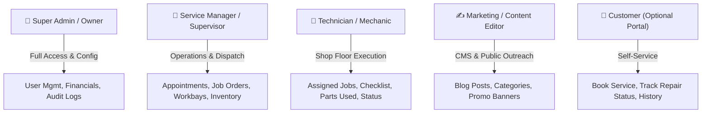
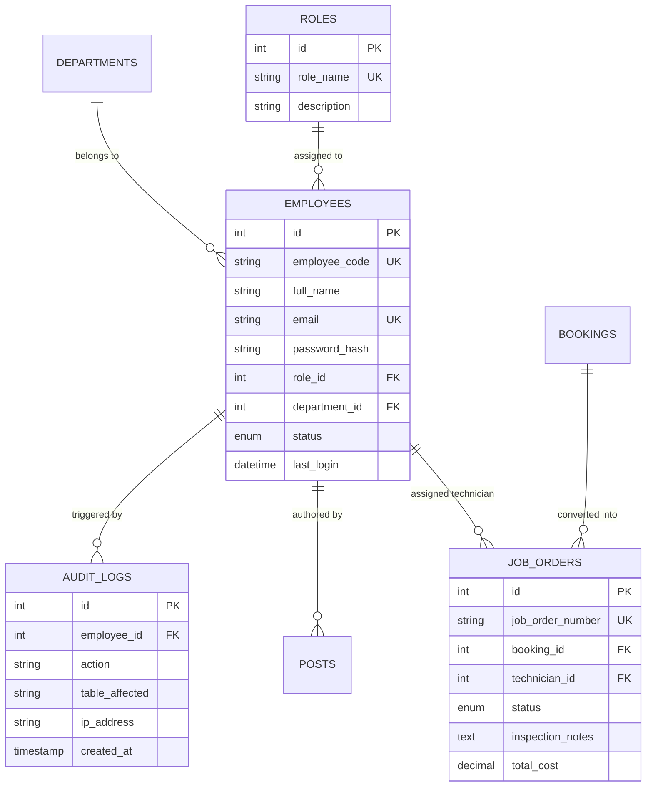
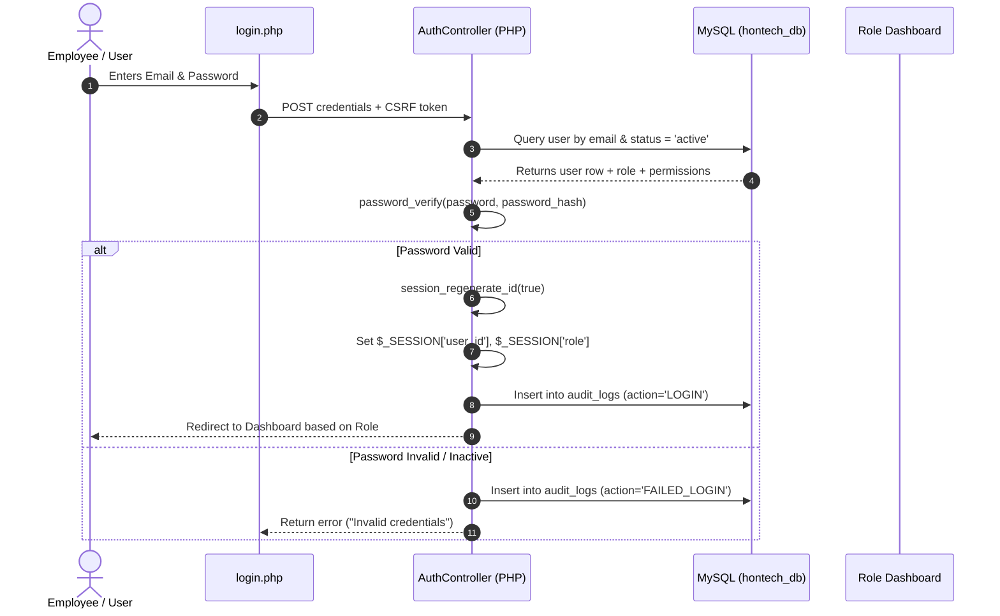

# Multi-Role Employee Authentication & RBAC System Architecture
### Project: Hontech Auto Center Inc. (PHP + MySQL + XAMPP)

---

## 1. Executive Summary & Goals
To support Hontech's daily operations and future growth, the system must accommodate various types of users—from shop floor mechanics and front-desk receptionists to marketing editors and executive management.

This document outlines a **Role-Based Access Control (RBAC)** architecture that is secure, scalable, and simple to implement in standard **PHP & MySQL** on **XAMPP**.

---

## 2. User Roles & Permission Matrix



### Detailed Permission Matrix

| Feature / Module | Super Admin | Service Manager | Technician | Marketing / Editor | Customer |
| :--- | :---: | :---: | :---: | :---: | :---: |
| **System Settings & User Creation** | ✅ Full | ❌ No | ❌ No | ❌ No | ❌ No |
| **View Audit & Security Logs** | ✅ Full | ❌ No | ❌ No | ❌ No | ❌ No |
| **Customer Inquiries & Leads** | ✅ Full | ✅ Full | 👁️ View Only | ❌ No | ❌ No |
| **Appointment Booking & Dispatch** | ✅ Full | ✅ Full | ❌ No | ❌ No | ➕ Create Own |
| **Job Orders & Workbay Allocation** | ✅ Full | ✅ Full | ✏️ Update Status | ❌ No | 👁️ Track Own |
| **Inspection & Service Checklists** | ✅ Full | ✅ Approve | ✅ Fill Out | ❌ No | 👁️ View Report |
| **Inventory & Spare Parts Logging** | ✅ Full | ✅ Full | ➕ Log Used Parts| ❌ No | ❌ No |
| **Blog Articles & Announcements** | ✅ Full | 👁️ View | ❌ No | ✅ Full | 👁️ Read Public |

---

## 3. Database Schema Blueprint (`hontech_rbac.sql`)



### Core SQL Tables Definition

```sql
-- 1. Roles Definition
CREATE TABLE roles (
    id INT AUTO_INCREMENT PRIMARY KEY,
    role_name VARCHAR(50) NOT NULL UNIQUE, -- 'super_admin', 'manager', 'technician', 'marketing'
    display_name VARCHAR(100) NOT NULL,
    description TEXT,
    created_at TIMESTAMP DEFAULT CURRENT_TIMESTAMP
);

-- 2. Departments
CREATE TABLE departments (
    id INT AUTO_INCREMENT PRIMARY KEY,
    name VARCHAR(100) NOT NULL, -- 'Mechanical', 'Electrical', 'Body & Paint', 'Front Desk', 'Marketing'
    created_at TIMESTAMP DEFAULT CURRENT_TIMESTAMP
);

-- 3. Employees / Staff Users
CREATE TABLE employees (
    id INT AUTO_INCREMENT PRIMARY KEY,
    employee_code VARCHAR(20) NOT NULL UNIQUE, -- e.g. 'HON-2026-001'
    full_name VARCHAR(100) NOT NULL,
    email VARCHAR(100) NOT NULL UNIQUE,
    phone VARCHAR(20),
    password_hash VARCHAR(255) NOT NULL,
    role_id INT NOT NULL,
    department_id INT NULL,
    avatar_url VARCHAR(255) DEFAULT 'assets/images/default-avatar.png',
    status ENUM('active', 'inactive', 'suspended') DEFAULT 'active',
    last_login DATETIME NULL,
    created_at TIMESTAMP DEFAULT CURRENT_TIMESTAMP,
    FOREIGN KEY (role_id) REFERENCES roles(id) ON DELETE RESTRICT,
    FOREIGN KEY (department_id) REFERENCES departments(id) ON DELETE SET NULL
);

-- 4. Password Reset & Account Recovery Tokens
CREATE TABLE password_resets (
    id INT AUTO_INCREMENT PRIMARY KEY,
    email VARCHAR(100) NOT NULL,
    token_hash VARCHAR(255) NOT NULL,
    expires_at DATETIME NOT NULL,
    created_at TIMESTAMP DEFAULT CURRENT_TIMESTAMP
);

-- 5. Audit Trail & Activity Logging
CREATE TABLE audit_logs (
    id INT AUTO_INCREMENT PRIMARY KEY,
    employee_id INT NULL,
    action VARCHAR(100) NOT NULL, -- e.g. 'LOGIN', 'UPDATED_JOB_STATUS', 'PUBLISHED_POST'
    description TEXT,
    ip_address VARCHAR(45),
    user_agent VARCHAR(255),
    created_at TIMESTAMP DEFAULT CURRENT_TIMESTAMP,
    FOREIGN KEY (employee_id) REFERENCES employees(id) ON DELETE SET NULL
);
```

---

## 4. Application Flow & Security Architecture



### Security Safeguards
1. **Password Hashing**: Standard `password_hash($password, PASSWORD_BCRYPT)` with cost parameter `12`.
2. **Session Hijacking Prevention**:
   - `session_regenerate_id(true)` executed upon authentication.
   - `session.cookie_httponly = 1` and `session.cookie_samesite = 'Strict'`.
3. **Role Authorization Middleware**:
   ```php
   // includes/auth_guard.php
   function require_roles(array $allowed_roles) {
       if (!isset($_SESSION['user_id'])) {
           header("Location: /hontech/admin/login.php?error=unauthorized");
           exit;
       }
       if (!in_array($_SESSION['role_name'], $allowed_roles)) {
           header("Location: /hontech/admin/403.php");
           exit;
       }
   }
   ```

---

## 5. Portal Navigation by Role

```
admin/
├── login.php                   # Unified login screen for all employees
├── forgot-password.php         # Token-based self-service recovery
├── dashboard.php               # Smart router -> directs to role view
│
├── views/
│   ├── admin_dashboard.php     # High-level KPIs, staff management, revenue stats
│   ├── manager_dashboard.php   # Today's appointments, workbay status, pending quotes
│   ├── tech_dashboard.php      # Mobile-friendly list of "My Assigned Jobs" & checklist
│   └── marketing_dashboard.php # Blog stats, published vs draft articles, comments
│
├── modules/
│   ├── users/                  # Staff account CRUD (Super Admin only)
│   ├── job-orders/             # Repair tickets & status transitions
│   ├── bookings/               # Customer appointments dispatch
│   ├── blog/                   # Blog post editor & media library
│   └── audit/                  # System log viewer
```

---

## 6. How Your Team Can Refine & Polish This Plan

1. **Department Roles Confirmation**: Confirm whether Hontech needs separate roles for *Inventory Custodians* or *Cashiers/Billing Staff*.
2. **Technician Mobile View**: Consider a mobile-first interface for mechanics so they can update job status (*"In Inspection" -> "Awaiting Parts" -> "Completed"*) right beside the service bay using a tablet or phone.
3. **Customer Portal Expansion**: Decide if customers will receive SMS/Email notifications (e.g. *"Your vehicle PMS is complete"*) or if it will be web-only.
