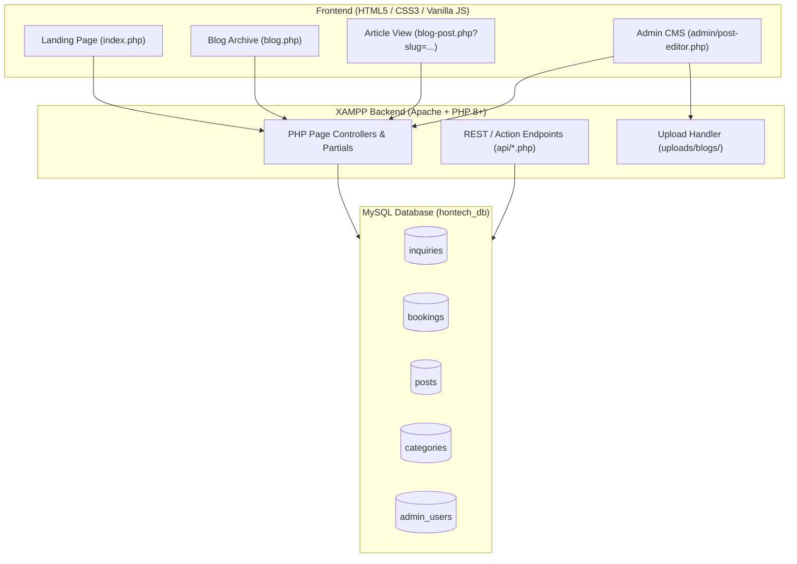

# Architecture & Implementation Plan: PHP, MySQL, HTML, CSS & Vanilla JS (XAMPP) + Blog System

## Context & Objective
The goal is to transition the **Hontech Auto Center** project into a unified, modular **PHP + MySQL + HTML5 + CSS3 + Vanilla JavaScript** web application for **XAMPP (Apache + MariaDB/MySQL + PHP)**, expanding the scope to include a **Full-Featured Blog & Content Management System (CMS)** for company news, automotive guides, and car maintenance tips.

---

## High-Level System Architecture



---

## Directory Structure (With Blog System)

```
Hontech_LandingPage/
├── config/
│   └── db.php                  # PDO connection wrapper with XAMPP defaults
├── database/
│   └── hontech_db.sql          # Complete SQL schema & sample blog posts
├── includes/
│   ├── header.php              # Global head, meta, styles, Lucide icons
│   ├── navbar.php              # Navigation with 'Blog' and active page highlight
│   ├── hero.php                # Hero banner & particle canvas
│   ├── about.php               # About company section
│   ├── vision_mission.php      # Vision & mission cards
│   ├── services.php            # Services breakdown
│   ├── estimator.php           # Interactive cost calculator
│   ├── blog_preview.php        # "Latest Articles & Maintenance Tips" preview on homepage
│   ├── milestones.php          # Milestones & timeline
│   ├── team.php                # Our team & leadership
│   ├── faq.php                 # Accordion FAQs
│   ├── contact.php             # Contact form
│   └── footer.php              # Global footer & social links
├── api/
│   ├── submit_contact.php      # AJAX inquiry submission
│   ├── submit_booking.php      # AJAX booking/estimator submission
│   ├── blog_actions.php        # Create/Edit/Delete blog posts (Admin)
│   └── upload_image.php        # Handles featured image uploads
├── admin/
│   ├── index.php               # Admin login & dashboard metrics
│   ├── inquiries.php           # Inquiries table & status updater
│   ├── bookings.php            # Service appointments table
│   ├── posts.php               # Blog posts management (publish/draft/delete)
│   ├── post-editor.php         # Create / Edit blog post with live image preview
│   └── categories.php          # Blog categories management
├── uploads/
│   └── blogs/                  # Uploaded featured images and thumbnails
├── assets/
│   ├── css/
│   │   ├── style.css           # Landing page & core styles
│   │   ├── blog.css            # Blog archive and single article reading layout
│   │   └── admin.css           # Admin dashboard & editor styling
│   ├── js/
│   │   ├── main.js             # Animations, particle canvas, counters, accordion
│   │   ├── estimator.js        # Cost calculator & selection logic
│   │   ├── contact.js          # AJAX form submissions & toast alerts
│   │   └── blog.js             # Blog category filtering & search
│   └── images/                 # Theme graphics & workshop photos
├── index.php                   # Main landing page
├── blog.php                    # Public Blog Archive (search, filter, pagination)
├── blog-post.php               # Single Article Reader page
└── README.md                   # Complete XAMPP setup & quickstart guide
```

---

## Database Design (`hontech_db.sql`)

### 1. `categories` (Blog Categories)
- `id` (INT, PK, AUTO_INCREMENT)
- `name` (VARCHAR 100) — *e.g., "Car Maintenance Tips", "Company News", "Promos"*
- `slug` (VARCHAR 100, UNIQUE) — *e.g., "car-maintenance-tips"*
- `created_at` (TIMESTAMP DEFAULT CURRENT_TIMESTAMP)

### 2. `posts` (Blog Articles)
- `id` (INT, PK, AUTO_INCREMENT)
- `category_id` (INT, FK -> categories.id)
- `title` (VARCHAR 255)
- `slug` (VARCHAR 255, UNIQUE)
- `excerpt` (TEXT) — *Short 2-sentence summary for previews & SEO meta*
- `content` (LONGTEXT) — *Full article body (supports formatting & headings)*
- `featured_image` (VARCHAR 255) — *Path to uploaded image e.g. `uploads/blogs/sample.jpg`*
- `author` (VARCHAR 100 DEFAULT 'Hontech Team')
- `views_count` (INT DEFAULT 0)
- `status` (ENUM: 'draft', 'published' DEFAULT 'published')
- `published_at` (DATETIME DEFAULT CURRENT_TIMESTAMP)
- `created_at` (TIMESTAMP DEFAULT CURRENT_TIMESTAMP)
- `updated_at` (TIMESTAMP DEFAULT CURRENT_TIMESTAMP ON UPDATE CURRENT_TIMESTAMP)

### 3. `inquiries` (Contact Form Leads)
- `id` (INT, PK, AUTO_INCREMENT)
- `name`, `email`, `phone`, `service_type`, `message`, `status`, `created_at`

### 4. `bookings` (Estimator / Appointment Bookings)
- `id` (INT, PK, AUTO_INCREMENT)
- `customer_name`, `customer_email`, `customer_phone`, `vehicle_model`, `selected_services`, `estimated_cost`, `preferred_date`, `notes`, `status`, `created_at`

### 5. `admin_users` (Admin Authentication)
- `id` (INT, PK, AUTO_INCREMENT)
- `username` (VARCHAR 50, UNIQUE), `password_hash` (VARCHAR 255), `full_name` (VARCHAR 100), `created_at`

---

## Detailed Roadmap: How We Will Build the Blog System

### Step 1: Database Setup & Sample Seed Data
- Create the `categories` and `posts` tables in `database/hontech_db.sql`.
- Seed 3-4 realistic automotive articles with images (e.g., *"5 Signs Your Car Brakes Need Replacement"*, *"Why CASA-Level PMS Saves You Money in the Long Run"*, *"Hontech Expands Service Bays in Metro Manila"*).

### Step 2: Public Blog Pages
1. **Homepage Integration (`includes/blog_preview.php`)**:
   - Queries the top 3 latest published posts from MySQL.
   - Renders modern cards with featured image, category badge, publication date, title, excerpt, and a "Read Article" link.
2. **Blog Catalog Page (`blog.php`)**:
   - Grid layout of all published articles.
   - Category filtering (filter by "Maintenance", "News", "Guides").
   - Search bar to search articles by keywords in title/content.
   - Clean pagination (e.g. 6 posts per page).
3. **Single Article Page (`blog-post.php`)**:
   - Dedicated reading layout with clean typography, breadcrumb navigation (`Home > Blog > Post Title`), estimated read time, social share buttons, author bio, and a "Related / Recent Articles" sidebar.
   - Dynamic OpenGraph and SEO meta tags based on the post title and excerpt.

### Step 3: Admin CMS & Post Editor (`admin/`)
1. **Post Management (`admin/posts.php`)**:
   - Table view showing: Title, Category, Author, Views, Status (Draft / Published), Date.
   - Actions: **Create New Post**, **Edit**, **Delete**, **Toggle Status**.
2. **Post Editor (`admin/post-editor.php`)**:
   - Clean, user-friendly form with:
     - Article Title (auto-generates URL slug).
     - Category dropdown selector.
     - Excerpt summary textarea.
     - Featured Image file uploader with live thumbnail preview.
     - Rich content area (supporting paragraphs, bullet lists, subheadings).
     - Status selector (Draft vs Published).
3. **Backend Handlers (`api/blog_actions.php` & `api/upload_image.php`)**:
   - Validates file types (`.jpg`, `.png`, `.webp`), sanitizes filenames, and stores images in `uploads/blogs/`.
   - Uses parameterized PDO queries to insert/update posts securely.

---

## Verification & Testing Plan
1. **Database Import**: Run SQL script in phpMyAdmin to create all tables and sample blog posts.
2. **Blog Public Browsing**:
   - Visit `index.php` -> verify the "Latest News" preview dynamically pulls the latest posts.
   - Visit `blog.php` -> test category filters and search bar.
   - Click a post -> verify `blog-post.php?slug=...` displays content and formatting accurately.
3. **Admin Blog CRUD**:
   - Log into `admin/index.php`.
   - Create a new blog post with a featured image.
   - Edit the post and publish it.
   - Verify it immediately appears on both the homepage preview and `blog.php`.
