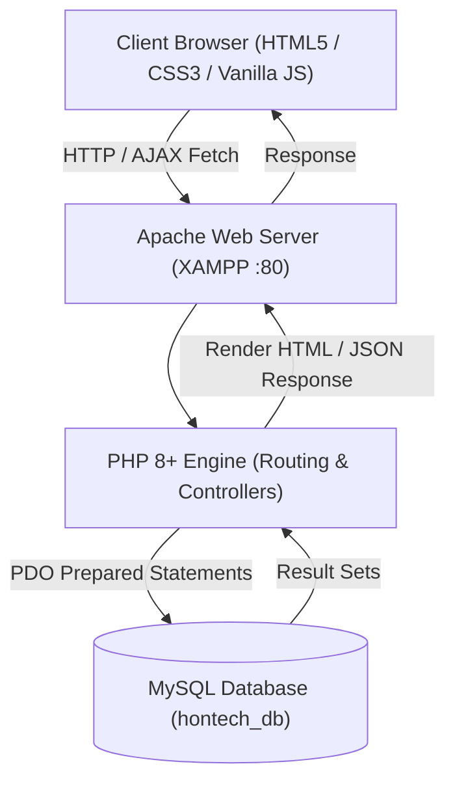
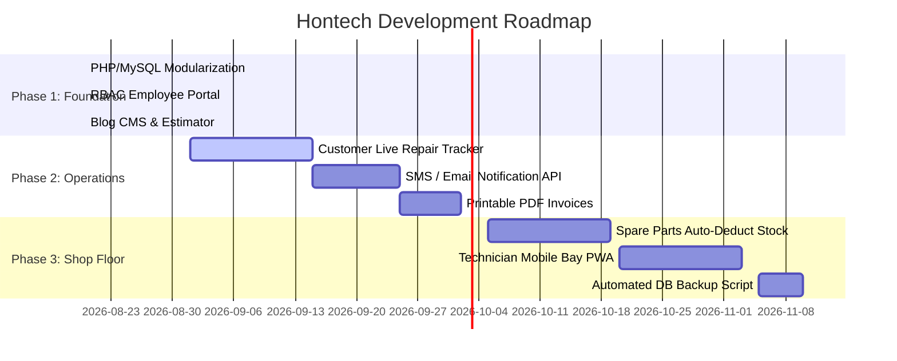

# Hontech Auto Center Inc. — Master System Documentation & Session Record

---

## 📌 1. Project Repositories & State Isolation

To preserve the client's currently approved user interface while advancing technical development, the system is separated into two isolated repositories:

| Repository Name | URL / Path | State / Purpose |
| :--- | :--- | :--- |
| **`HontechPrototype_Homepage`** (Primary Workspace) | [Justin-stack101/HontechPrototype_Homepage](https://github.com/Justin-stack101/HontechPrototype_Homepage.git) | **100% Pristine & Untouched** on `main` for ongoing client review. |
| **`Hontech-Operations-System-V2`** (Draft & V2 System) | [Justin-stack101/Hontech-Operations-System-V2](https://github.com/Justin-stack101/Hontech-Operations-System-V2) | **New Modular PHP + MySQL + RBAC + Blog CMS** architecture for team development. |

---

## 🏛️ 2. Architectural Blueprint (XAMPP Stack)



### Directory Structure
```
Hontech-Operations-System-V2/
├── config/
│   └── db.php                  # PDO connection wrapper with XAMPP defaults & fallback
├── database/
│   └── hontech_db.sql          # Complete schema (roles, employees, blogs, bookings, inquiries)
├── includes/
│   ├── header.php              # Global head, meta tags, and stylesheets
│   ├── navbar.php              # Responsive navigation with Staff Portal button
│   ├── hero.php                # Hero banner, interactive canvas, and statistics
│   ├── about.php               # About company & quality standards
│   ├── vision_mission.php      # Vision, mission, and 6 C's philosophy
│   ├── services.php            # Service breakdown
│   ├── estimator.php           # Service Cost Calculator & booking modal
│   ├── blog_preview.php        # Latest blog articles query on homepage
│   ├── milestones.php          # Milestones & company growth timeline
│   ├── team.php                # Specialist team departments
│   ├── faq.php                 # Accordion FAQs
│   ├── contact.php             # Contact form & location information
│   └── footer.php              # Global footer & scripts
├── api/
│   ├── submit_contact.php      # Saves customer inquiries to MySQL
│   ├── submit_booking.php      # Saves service appointments to MySQL
│   ├── auth.php                # Staff authentication, password_verify & RBAC sessions
│   └── blog_actions.php        # Create, edit, delete blog articles
├── admin/
│   ├── login.php               # Unified staff login screen (with 1-click test autofill)
│   ├── logout.php              # Session destruction & sign out
│   ├── dashboard.php           # Role-based dashboard (Admin, Manager, Tech, Marketing)
│   ├── bookings.php            # Appointment manager & bay dispatcher
│   ├── inquiries.php           # Customer inquiries manager
│   ├── posts.php               # Blog posts listing & actions
│   ├── post-editor.php         # Blog article writer with image upload
│   └── employees.php           # Staff roster & role view
├── uploads/
│   └── blogs/                  # Uploaded featured images
├── assets/
│   ├── js/
│   │   ├── main.js             # Canvas particles, counters, reveal animations
│   │   ├── estimator.js        # Dynamic calculation & modal logic
│   │   └── contact.js          # AJAX submission & toast notifications
│   └── images/                 # Theme graphics & photos
├── index.php                   # Master homepage entry point
├── blog.php                    # Public blog archive
└── blog-post.php               # Single article reader
```

---

## 🗄️ 3. Database Schema Overview (`hontech_db.sql`)

| Table Name | Description | Key Columns |
| :--- | :--- | :--- |
| **`roles`** | System permission roles | `id`, `role_name`, `display_name`, `description` |
| **`departments`** | Company service departments | `id`, `name`, `description` |
| **`employees`** | Staff accounts with bcrypt password hashes | `id`, `employee_code`, `full_name`, `email`, `password_hash`, `role_id`, `department_id`, `status` |
| **`categories`** | Blog topic classifications | `id`, `name`, `slug`, `description` |
| **`posts`** | Blog articles & maintenance guides | `id`, `category_id`, `author_id`, `title`, `slug`, `excerpt`, `content`, `featured_image`, `status`, `published_at` |
| **`inquiries`** | Customer contact inquiries | `id`, `name`, `email`, `phone`, `service_type`, `message`, `status` |
| **`bookings`** | Service appointments & estimator leads | `id`, `booking_reference`, `customer_name`, `customer_email`, `customer_phone`, `vehicle_model`, `selected_services`, `estimated_cost`, `preferred_date`, `status` |
| **`job_orders`** | Technician repair orders & checklists | `id`, `job_order_no`, `booking_id`, `technician_id`, `vehicle_info`, `work_description`, `status`, `inspection_notes` |
| **`audit_logs`** | Administrative security & activity log | `id`, `employee_id`, `action`, `description`, `ip_address`, `created_at` |

---

## 🔑 4. Staff & Employee Demo Credentials (RBAC)

All accounts are pre-seeded in `database/hontech_db.sql` with default password: **`password123`**

| Role | Email | Password | Role Responsibilities |
| :--- | :--- | :--- | :--- |
| **Super Admin** | `admin@hontech.com` | `password123` | Full system control, user accounts, audit trails, and system settings. |
| **Service Manager** | `manager@hontech.com` | `password123` | Appointment dispatching, workbay capacity, customer inquiries. |
| **Senior Technician** | `technician@hontech.com` | `password123` | View assigned job orders, update vehicle repair status, fill checklists. |
| **Marketing Editor** | `marketing@hontech.com` | `password123` | Write, edit, and publish blog articles, car maintenance tips, and promos. |

---

## 🚀 5. Development Roadmap & Future Milestones



---

## 📚 6. Documentation Artifact Index
All detailed planning and architecture documents are saved in the project artifacts:
1. 📑 **[walkthrough.md](file:///C:/Users/justi/.gemini/antigravity-ide/brain/e5008e28-55ea-4109-b8c7-45eb90db9e25/walkthrough.md)**: Master session record and system walkthrough.
2. 📋 **[todo_and_roadmap.md](file:///C:/Users/justi/.gemini/antigravity-ide/brain/e5008e28-55ea-4109-b8c7-45eb90db9e25/todo_and_roadmap.md)**: Technical TODO list, agent guidelines, and feature backlog.
3. 🛡️ **[employee_rbac_architecture.md](file:///C:/Users/justi/.gemini/antigravity-ide/brain/e5008e28-55ea-4109-b8c7-45eb90db9e25/employee_rbac_architecture.md)**: Role-Based Access Control and Security specifications.
4. 📐 **[implementation_plan.md](file:///C:/Users/justi/.gemini/antigravity-ide/brain/e5008e28-55ea-4109-b8c7-45eb90db9e25/implementation_plan.md)**: Initial architectural and technical design document.
